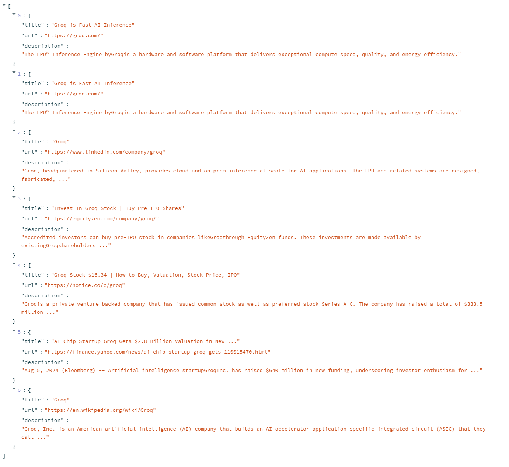

# Groqqle: Your AI-Powered Search Engine


Groqqle is an innovative, AI-powered search engine that combines the power of large language models with web search capabilities. It offers both a user-friendly web interface and a robust API for seamless integration into your projects.

[](https://opensource.org/licenses/MIT)
[](https://www.python.org/downloads/)

## 🌟 Features

- 🔍 Advanced search capabilities powered by AI
- 🖥️ Intuitive web interface for easy searching
- 🚀 Fast and efficient results using Groq's high-speed inference
- 🔌 RESTful API for programmatic access
- 🔒 Secure handling of API keys
- 📊 Option to view results in JSON format
- 🔄 Extensible architecture for multiple AI providers

    

## 🛠️ Installation

1. Clone the repository:
   ```
   git clone https://github.com/jgravelle/Groqqle.git
   cd Groqqle
   ```

2. Set up a virtual environment:
   ```
   python -m venv venv
   source venv/bin/activate  # On Windows, use `venv\Scripts\activate`
   ```

3. Install the required packages:
   ```
   pip install -r requirements.txt
   ```

4. Set up your environment variables:
   Create a `.env` file in the project root and add your Groq API key:
   ```
   GROQ_API_KEY=your_api_key_here
   ```

## 🚀 Usage

### Web Interface

1. Start the Groqqle application:
   ```
   python Groqqle.py
   ```

2. Open your web browser and navigate to `http://localhost:8501`.

3. Enter your search query in the search bar and click "Groqqle Search" or press Enter.

4. View your results! Toggle the "JSON Results" checkbox to see the raw JSON data.


### API

The Groqqle API allows you to programmatically access search results. Here's how to use it:

1. Start the Groqqle application in API mode:
   ```
   python Groqqle.py api
   ```

2. The API server will start running on `http://127.0.0.1:5000`.

3. Send a POST request to `http://127.0.0.1:5000/search` with the following JSON body:
   ```json
   {
     "query": "your search query"
   }
   ```

   Note: The API key is now managed through environment variables, so you don't need to include it in the request.

4. The API will return a JSON response with your search results.

Example using Python's `requests` library:

```python
import requests

url = "http://127.0.0.1:5000/search"
data = {
    "query": "artificial intelligence"
}
response = requests.post(url, json=data)
results = response.json()
print(results)

Make sure you have set the `GROQ_API_KEY` in your environment variables or `.env` file before starting the API server.
```



## 🔄 AI Providers

While Groqqle is optimized for use with Groq's lightning-fast inference capabilities, we've also included stubbed-out provider code for Anthropic. This demonstrates how easily other AI providers can be integrated into the system. 

Please note that while other providers can be added, they may not match the exceptional speed offered by Groq. Groq's high-speed inference is a key feature that sets Groqqle apart in terms of performance.

## 🤝 Contributing

We welcome contributions to Groqqle! Here's how you can help:

1. Fork the repository
2. Create your feature branch (`git checkout -b feature/AmazingFeature`)
3. Commit your changes (`git commit -m 'Add some AmazingFeature'`)
4. Push to the branch (`git push origin feature/AmazingFeature`)
5. Open a Pull Request

Please make sure to update tests as appropriate and adhere to the [Code of Conduct](CODE_OF_CONDUCT.md).

## 📄 License

Distributed under the MIT License. See `LICENSE` file for more information.  Mention J. Gravelle in your docs (README, etc.) and/or code.  He's kind of full of himself.

## 📞 Contact

J. Gravelle - j@gravelle.us - https://j.gravelle.us

Project Link: [https://github.com/jgravelle/Groqqle](https://github.com/jgravelle/Groqqle)

## 🙏 Acknowledgements

- [Groq](https://groq.com/) for their powerful and incredibly fast language models
- [Streamlit](https://streamlit.io/) for the amazing web app framework
- [FastAPI](https://fastapi.tiangolo.com/) for the high-performance API framework
- [Beautiful Soup](https://www.crummy.com/software/BeautifulSoup/) for web scraping capabilities


